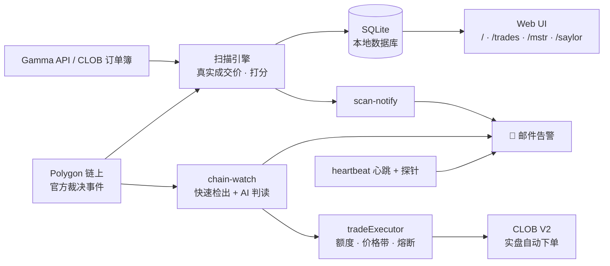
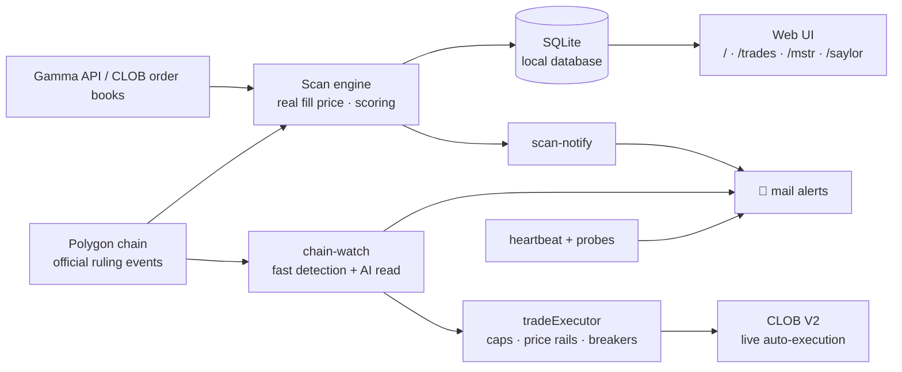

<div align="center">

# ⚡ PredEdge

**比市场更早读懂官方链上裁决,并自动完成交易。**

**Reads official on-chain rulings before the market does — and trades on them automatically.**

一套围绕 Polymarket 的自动化交易系统:发现机会 → AI 判读 → 实盘下单 → 风控熔断,全程无人值守。

[简体中文](#-简体中文) · [English](#-english)

<br/>


</div>

---

## 🇨🇳 简体中文

### 💡 盈利模式

先用一句话解释 Polymarket:它是全球最大的预测市场,人们在上面对"某件事会不会发生"下注。每份合约猜对了值 $1、猜错了归零,所以合约价格就是市场眼中的概率——0.95 的价格意味着市场认为有 95% 的把握。

**PredEdge 赚的是信息差:不少市场的最终结果,在正式结算之前就已经写在区块链上了,只是大多数交易者没有看到,或者没有及时读懂。**

当 Polymarket 的市场结果出现争议时,会进入一套官方仲裁流程,官方的澄清与裁决文本会直接发布到链上。这份文本往往提前反映了最终结果,但要利用它并不容易:

- 它藏在链上合约事件里,普通交易者一般不会去监控;
- 文本是规则条文式的英文,人工读出方向需要时间;
- 从文本上链到市场价格调整到位,通常有几分钟到几小时的窗口。

PredEdge 做的就是利用这个窗口,三步自动完成:

1. **快速发现** — 7×24 监听链上的官方动作(争议、澄清、改判)。如果官方预告"将于某时刻发布澄清",系统会提前调高轮询频率,在承诺窗口内数秒级检出;
2. **AI 判读方向** — 正则规则先读一遍,Claude 再独立读一遍,两者结论一致且置信度高才给 🟢 信号。AI 只做文本判读、不预测事件本身,给出的方向必须有官方原文的逐字引文支撑;
3. **自动下单** — 🟢 信号直接实盘买入,从链上检出到订单成交通常只需要几秒,无需人工值守。

这套分级有数据依据:基于 15 个月、2,182 个历史信号、真实成交价的回测,🟢 双确认信号平均每笔约 +21%;此外每年还有少量赔率很高的"翻盘"类机会(历史上约 2–4 次)。完整的研究报告以 PDF 形式附在仓库中。

系统还有第二个策略:**尾价扫描**。遍历全市场中定价在 0.93–0.995 之间、结果基本确定的合约,逐档计算订单簿上真实能成交的价格,经过风险打分后买入,赚取最后几个点的收敛收益。

### 📈 案例:Saylor 买币市场(已停用)

Michael Saylor 的 Strategy(原 MicroStrategy)曾经连续多年几乎每周买入比特币,Polymarket 上也长期挂着对应的周度市场:**"MSTR 本周会买比特币吗?"**

他的节奏有很强的规律性:周末发"橙点"推特预告,周一提交 8-K 公告;财报静默期停买,联邦假日顺延,大型融资操作前后会中断一两周。PredEdge 把推文线索、财报日历、假日和资本运作建模成信号,回测出的严格信号组合:**41 次交易、胜率 87.8%、平均每笔 +25.6%**。

后来 Strategy 开始出售比特币,持续多年的"每周买入"节奏中断,这个市场失去了可利用的规律,策略随之停用。这也正好说明了这类策略的特点:**规律有效时收益可观,规律消失后及时退出。** 完整的复盘与信号模型保留在 `/mstr` 和 `/saylor` 两个页面里。

### ✨ 功能一览

| 页面 | 说明 |
| --- | --- |
| 🔍 **扫描器** `/` | 扫描全市场中结果基本确定、但仍有收益空间的合约,按真实可成交价格与风险打分排序;可按标签筛选、按自己的仓位实时重算 |
| 📒 **纸面交易** `/trades` | 先用虚拟仓位验证策略,持续追踪每一笔选中标的的真实走势与盈亏 |
| 📊 **MSTR 复盘** `/mstr` | Saylor 买币策略的完整回测复盘与实盘验证记录 |
| 🐦 **Saylor 信号** `/saylor` | 推文线索 + 财报日历 + 假日建模出的周度买币概率预测(策略已停用,页面存档) |

### 🤖 自动实盘执行

🟢 信号从检出到下单自动完成,同时配有多层相互独立的风控:

- **三档开关**:off / dry(全流程演练、不真实提交)/ live
- **三层金额上限**:单笔、单日、未结算总敞口
- **价格防线**:入场价带约束、追高限制、暴跌守卫——市场已经反向定价时不再入场
- **不重复下单**:下单前先写入账本(write-ahead),即使进程在下单过程中崩溃,重启后也不会对同一信号重复下单
- **多重熔断**:kill-switch 文件放置即停、连续执行错误自动停、连续亏损自动停
- **自动对账**:结算后按官方结算价核算盈亏,通过邮件汇报

启用真实交易前有完整的自检流程:`exec-selftest` 逐项检查下单链路,支持全流程演练和 $1 实单探针,验证通过后再切换 live。

### 🛰 无人值守运维

整套系统可以在一台小型服务器上长期无人值守运行:

| 脚本 | 用途 |
| --- | --- |
| `npx tsx scripts/chain-watch.ts` | **争议监控主通道**:监听链上官方动作 → AI 判读方向 → 分级邮件告警 → 🟢 信号自动下单;官方预告澄清时间时提前提高轮询频率、数秒级检出 |
| `npm run scan:notify` | 无头全市场扫描,发现新机会时发送 HTML 邮件,自动去重、避免重复通知 |
| `npx tsx scripts/heartbeat.ts --watch` | 系统自检:通道中断、邮件发送失败、登录态失效等问题及时告警,恢复后发送恢复通知 |
| `npx tsx scripts/heartbeat.ts --daily` | 每日运行日报,兼作系统存活心跳 |
| `npx tsx scripts/exec-selftest.ts` | 下单链路自检:钱包、凭证、余额、盘口逐项检查;`--dry-exec` 全流程演练,`--probe` $1 实单探针 |
| `npm run mail:test` | 邮件配置自检 |

### 🚀 快速开始

```bash
npm install
npm run dev
```

打开 [http://localhost:3000](http://localhost:3000),在扫描器页点击 **Scan** 拉取最新市场(首次约 30–60 秒)。

> **本地运行,无云端依赖。** 一次全量扫描要遍历数千个市场,本地运行没有 serverless 超时限制,数据也全部保存在自己机器上。

所有数据(扫描批次、机会、赔率快照、纸面交易)都存在本地 SQLite,由 Node 内置的 `node:sqlite` 驱动,首次运行自动建库,无需任何外部数据库。要求 Node.js ≥ 24。

### 🏗 架构



<details>
<summary><b>⚙️ 环境变量(点击展开)</b></summary>

| 变量 | 说明 |
| --- | --- |
| `LOCAL_DB_PATH` | SQLite 数据库路径(默认 `data/prededge.sqlite`) |
| `SMTP_HOST` / `SMTP_PORT` / `SMTP_SECURE` | SMTP 服务器配置 |
| `MAIL_USER` / `MAIL_AUTH_CODE` | 发信账号与授权码 |
| `MAIL_FROM_NAME` / `MAIL_TO` | 发件人显示名 / 收件地址 |
| `POLYGON_RPC_URL` | 应用内链上读取所用的 Polygon RPC |
| `ONCHAIN_RPC_URLS` | chain-watch 的 RPC 列表(逗号分隔,多节点冗余) |
| `CHAIN_WATCH_STATE` | chain-watch 状态文件路径(默认 `data/chain-watch-state.json`) |
| `HC_PING_SCAN_NOTIFY` / `HC_PING_CHAIN_WATCH` / `HC_PING_HEARTBEAT` | healthchecks.io 外部保活 ping 地址 |
| `CLAUDE_CODE_OAUTH_TOKEN` | headless Claude 判读的认证(`claude setup-token` 生成);缺省时 LLM 二读关闭,回退纯正则分级 |
| `LLM_STANCE` / `LLM_STANCE_MODEL` | `off` 关闭 LLM 二读 / 判读模型(默认 `claude-opus-4-8`) |
| `LLM_BOUNDARY_GUARD` | `off` 关闭边界闸门标注(A/B 用) |
| `PAPER_TRADES_AUTO` | `off` 关闭 🟢 信号自动登记 paper_trades |
| `CHAIN_WATCH_PREARM` | `off` 关闭预告时点预埋与承诺窗口快轮询 |
| `EXEC_MODE` | 自动执行三态闸门:`off`(默认)/ `dry` / `live` |
| `EXEC_MAX_ORDER_USD` / `EXEC_DAILY_MAX_USD` / `EXEC_TOTAL_MAX_USD` | 单笔 / UTC 日 / 未结算总敞口上限(默认 50 / 150 / 400) |
| `EXEC_MIN_PRICE` / `EXEC_MAX_PRICE` | 入场价带(默认 0.15 / 0.97) |
| `EXEC_SLIPPAGE` / `EXEC_SLIPPAGE_EDGE_FRAC` / `EXEC_CRASH_DROP_FRAC` | 限价滑点帽 / 追高带边缩放系数 / 暴跌守卫系数 |
| `EXEC_LOSS_HALT_COUNT` | 连亏熔断阈值(默认 3 笔) |
| `EXEC_HALT_FILE` / `EXEC_LEDGER` | kill-switch 文件(默认 `data/trading-halt`)/ 交易账本(默认 `data/trade-ledger.jsonl`) |
| `EXEC_WALLET_JSON` / `EXEC_CREDS_JSON` / `EXEC_FUNDER` | EOA 钱包 JSON / CLOB L2 creds 缓存 / Polymarket proxy 钱包地址 |

</details>

---

## 🇬🇧 English

### 💡 How it makes money

One sentence on Polymarket first: it's the world's largest prediction market, where people bet on whether things will happen. Each contract pays $1 if you're right and $0 if you're wrong — so the price *is* the market's probability. A contract at 0.95 means the crowd is 95% sure.

**PredEdge trades on an information gap: for a fair number of markets, the final outcome is written on the blockchain before settlement — most traders simply don't see it, or don't parse it in time.**

When a Polymarket outcome is contested, it goes through an official arbitration process, and the official clarification and ruling text is published directly on-chain. That text often reveals the final result ahead of time, but acting on it isn't trivial:

- It's buried in on-chain contract events that ordinary traders don't monitor;
- It's legalistic English — reading out the direction by hand takes time;
- Between the text landing on-chain and the price adjusting, there's typically a window of minutes to hours.

PredEdge is built to use that window, in three automated steps:

1. **Detect quickly** — watch official on-chain moves (disputes, clarifications, resets) 24/7. When officials pre-announce "a clarification will be issued at …", the system raises its polling rate and detects the text within seconds of the promised window;
2. **AI reads the direction** — a rule-based pass first, then an independent Claude read; only when both agree at high confidence does a signal earn 🟢. The AI judges *text only* — it never predicts the event itself, and every directional verdict must be backed by a verbatim quote from the official text;
3. **Auto-execute** — 🟢 signals are bought live, typically seconds from on-chain detection to filled order, with no one at a screen.

The tiers are backtest-derived: over 15 months and 2,182 historical signals priced against real fills, 🟢 double-confirmed signals averaged about **+21% per trade**, plus a small number of high-payout reversal cases per year (historically 2–4). The full research reports ship as PDFs in this repo.

There's a second strategy as well: **tail-price scanning**. Sweep the market for contracts priced 0.93–0.995 whose outcome is essentially settled, walk the order book to compute the price you'd actually fill at, score the risk, and capture the last few cents of convergence.

### 📈 Case study: the Saylor bitcoin market (retired)

Michael Saylor's Strategy (formerly MicroStrategy) bought bitcoin almost every week for years, and Polymarket ran a weekly market on it: **"Will MSTR buy bitcoin this week?"**

His cadence was highly regular: an "orange dot" tweet over the weekend, an 8-K filing on Monday; purchases paused during earnings quiet periods, slipped around federal holidays, and stalled for a week or two around big financing moves. PredEdge modeled all of it — tweet cues, the earnings calendar, holidays, capital actions — into signals. The strict-signal combo backtested at **41 trades, 87.8% win rate, +25.6% average per trade**.

Strategy has since started selling bitcoin. The years-long weekly cadence is broken and the pattern is gone, so the strategy has been retired. Which illustrates how this kind of strategy works: **profit while the pattern holds, and exit once it stops working.** The full post-mortem and signal model remain at `/mstr` and `/saylor`.

### ✨ Features

| Page | Description |
| --- | --- |
| 🔍 **Scanner** `/` | Sweeps the market for contracts that are essentially settled but still carry an edge, ranked by real fillable price and risk score; filter by tag, recompute live at your own trade size |
| 📒 **Paper Trading** `/trades` | Validate the strategy with virtual positions first — every pick is tracked against its real outcome |
| 📊 **MSTR Review** `/mstr` | Full backtest review and live verification record of the Saylor bitcoin strategy |
| 🐦 **Saylor Signal** `/saylor` | Weekly buy-probability model from tweet cues + earnings calendar + holidays (strategy retired, page archived) |

### 🤖 Live Auto-Execution

🟢 signals go from detection to filled order automatically, with several independent risk controls:

- **Three-position switch**: off / dry (full rehearsal incl. signing, nothing submitted) / live
- **Three spending caps**: per-order, per-day, and total open exposure
- **Price rails**: entry band, chase limit, and a crash guard — no entry once the market is already pricing the other way
- **No duplicate orders**: a write-ahead ledger journals every order before it's posted, so even a process crash mid-order can't make the same signal fire twice after restart
- **Multiple circuit breakers**: a kill-switch file halts everything, consecutive errors auto-halt, consecutive losses auto-halt
- **Auto reconciliation**: realized PnL is booked against official settlement prices and reported by mail

Before real money moves, there's a full pre-flight: `exec-selftest` checks the order path item by item, with a full dry rehearsal and a $1 live probe — verify first, then switch to live.

### 🛰 Headless Ops

The whole system runs unattended on a small server:

| Script | Purpose |
| --- | --- |
| `npx tsx scripts/chain-watch.ts` | **Primary dispute watcher**: monitors official on-chain moves → AI reads the direction → tiered mail alerts → 🟢 signals auto-execute; raises polling rate around announced clarification times for detection within seconds |
| `npm run scan:notify` | Headless full-market scan; mails an HTML alert for genuinely new opportunities, deduped to avoid repeat notifications |
| `npx tsx scripts/heartbeat.ts --watch` | Self-monitoring: a dead channel, failing mailer, or dropped login is flagged promptly, with a recovery notice once it heals |
| `npx tsx scripts/heartbeat.ts --daily` | Daily ops report, doubling as the system-alive heartbeat |
| `npx tsx scripts/exec-selftest.ts` | Order-path self-check: wallet, creds, balance, order book checked item by item; `--dry-exec` full rehearsal, `--probe` $1 live probe |
| `npm run mail:test` | SMTP self-test |

### 🚀 Getting Started

```bash
npm install
npm run dev
```

Open [http://localhost:3000](http://localhost:3000) and click **Scan** on the Scanner page to fetch the latest markets (the first run takes 30–60s).

> **Local-first, no cloud dependencies.** A full scan walks thousands of markets — running locally means no serverless timeouts, and all data stays on your own machine.

Everything (scan runs, opportunities, odds snapshots, paper trades) lives in a local SQLite database powered by Node's built-in `node:sqlite`, created automatically on first run — no external database. Requires Node.js ≥ 24.

### 🏗 Architecture



<details>
<summary><b>⚙️ Environment Variables (click to expand)</b></summary>

| Variable | Description |
| --- | --- |
| `LOCAL_DB_PATH` | SQLite database path (default `data/prededge.sqlite`) |
| `SMTP_HOST` / `SMTP_PORT` / `SMTP_SECURE` | SMTP server configuration |
| `MAIL_USER` / `MAIL_AUTH_CODE` | Sender account and auth code |
| `MAIL_FROM_NAME` / `MAIL_TO` | Sender display name / recipient address |
| `POLYGON_RPC_URL` | Polygon RPC used for on-chain reads inside the app |
| `ONCHAIN_RPC_URLS` | RPC list for chain-watch (comma-separated, multi-node redundancy) |
| `CHAIN_WATCH_STATE` | chain-watch state file path (default `data/chain-watch-state.json`) |
| `HC_PING_SCAN_NOTIFY` / `HC_PING_CHAIN_WATCH` / `HC_PING_HEARTBEAT` | healthchecks.io external liveness ping URLs |
| `CLAUDE_CODE_OAUTH_TOKEN` | Auth for headless Claude second reads (from `claude setup-token`); when absent, tiering falls back to regex only |
| `LLM_STANCE` / `LLM_STANCE_MODEL` | `off` disables the LLM second read / judgment model (default `claude-opus-4-8`) |
| `LLM_BOUNDARY_GUARD` | `off` disables the boundary-clarification tag (for A/B) |
| `PAPER_TRADES_AUTO` | `off` disables automatic paper-trade registration of 🟢 signals |
| `CHAIN_WATCH_PREARM` | `off` disables scheduled-clarification pre-arm and the promised-window fast poll |
| `EXEC_MODE` | Auto-execution gate: `off` (default) / `dry` / `live` |
| `EXEC_MAX_ORDER_USD` / `EXEC_DAILY_MAX_USD` / `EXEC_TOTAL_MAX_USD` | Per-order / UTC-daily / open-exposure caps (defaults 50 / 150 / 400) |
| `EXEC_MIN_PRICE` / `EXEC_MAX_PRICE` | Entry price band (defaults 0.15 / 0.97) |
| `EXEC_SLIPPAGE` / `EXEC_SLIPPAGE_EDGE_FRAC` / `EXEC_CRASH_DROP_FRAC` | Limit-price slippage cap / chase-band edge scaling / crash-guard fraction |
| `EXEC_LOSS_HALT_COUNT` | Consecutive settled-loss circuit-breaker threshold (default 3) |
| `EXEC_HALT_FILE` / `EXEC_LEDGER` | Kill-switch file (default `data/trading-halt`) / trade ledger (default `data/trade-ledger.jsonl`) |
| `EXEC_WALLET_JSON` / `EXEC_CREDS_JSON` / `EXEC_FUNDER` | EOA wallet JSON / CLOB L2 creds cache / Polymarket proxy wallet address |

</details>

---

<div align="center">
<sub>Built with Next.js · Local-first · No external database · Research reports included as PDFs</sub>
</div>
