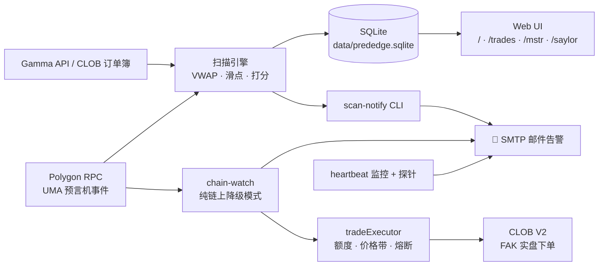
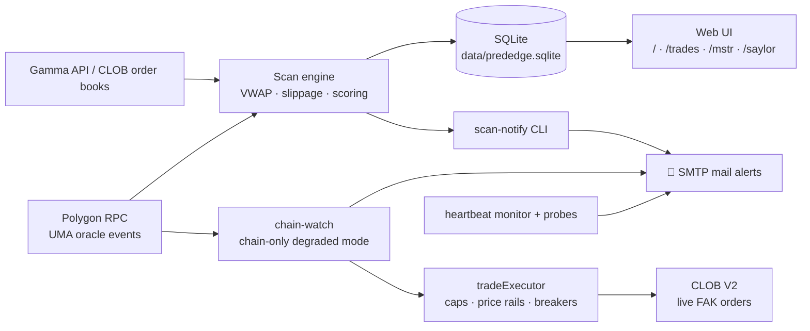

<div align="center">

# ⚡ PredEdge

**Polymarket 尾价机会扫描 · 争议监控 · 实盘自动执行 · 纸面交易追踪**

**Tail-price opportunity scanner, dispute watcher, live auto-executor & paper-trading tracker for Polymarket**

[简体中文](#-简体中文) · [English](#-english)

<br/>


</div>

---

## 🇨🇳 简体中文

PredEdge 是一个 **local-first** 的 [Next.js](https://nextjs.org) 应用:全量扫描 Polymarket 尾价区(0.93–0.995)合约,逐档吃单计算真实成交 VWAP 与滑点,结合链上 UMA 预言机争议状态与官方澄清文本打分,并支持纸面交易验证策略表现。同时内置一套无头 cron 运维体系(邮件告警 + 链上降级模式 + 心跳监控 + 静默单点探针),可跑在一台小服务器上 7×24 盯盘;🟢 双确认信号可选**全自动实盘执行**(默认关闭,多层风控与熔断,见下文)。

### ✨ 功能一览

| 页面 | 说明 |
| --- | --- |
| 🔍 **扫描器** `/` | 全量扫 Polymarket 尾价合约,吃穿订单簿 ask 侧计算 fill-aware VWAP 与滑点,按可行 / 观察 / 拒绝三档打分排序;支持按标签过滤、按自定义仓位实时重算;展示链上争议事件与 dispute-coverage 数据 |
| 📒 **纸面交易** `/trades` | 对扫描出的机会模拟建仓,持续追踪扫描器选中标的的真实走势与盈亏 |
| 📊 **MSTR 报告** `/mstr` | Polymarket × Saylor 严格信号周度 BTC 策略的回测复盘与实时验证 |
| 🐦 **Saylor 信号** `/saylor` | 综合 @saylor 推文线索、财报日历、美国联邦假日与资本运作,预测 MSTR 下周买入 BTC 的概率 |

### 🛰 无头运维(cron)

| 脚本 | 用途 |
| --- | --- |
| `npm run scan:notify` | 无头扫描 + 邮件通知:探测 Gamma 可达性 → 全量扫描 → 状态文件去重防轰炸 → 只对新机会 / 状态变化发 HTML 邮件 |
| `npx tsx scripts/chain-watch.ts` | **争议监控主通道**:只依赖 Polygon RPC(多节点冗余),扫 `QuestionReset` / `AncillaryDataUpdated` 事件,读官方澄清文本 → 正则分类 + headless Claude(Opus 4.8)二读 → 分级告警(🟢🔥 肥尾候选 / 🟢 双确认·高置信 / 🟠 方向存疑 / 🔵 LLM 独判),附盘口可执行性注解与自动 paper-trade 登记;含逆共识红旗、肥尾复判、洪水汇总限流(动过真金的条目强制即时邮件)、**预告时点预埋**(官方预告"将于某时点澄清"→ 提前邮件预警 + 承诺窗口内 12s 快轮询秒级检出)、🟢 信号自动实盘执行(见下节) |
| `npx tsx scripts/heartbeat.ts --watch` | 心跳监控 + 静默单点探针:通道标记文件超龄告警;SMTP verify / kill-switch 文件 / Gamma 代理可达 / claude 登录态四探针,恢复发恢复邮件(边沿触发,不轰炸) |
| `npx tsx scripts/heartbeat.ts --daily` | 每日运行日报(含探针状态区块),本身兼作日频"系统活着"心跳 |
| `npx tsx scripts/exec-selftest.ts` | 自动下单链路体检:钱包 / L2 creds / 余额授权 / 盘口只读自检;`--dry-exec` 全路径演练(签名不提交);`--probe` $1 远价 FAK 探针实弹验证 postOrder 端到端 |
| `npm run mail:test` | SMTP 发信配置自检 |

### 🤖 实盘自动执行(默认关闭)

chain-watch 的 🟢 双确认信号可以直接自动下单(`EXEC_MODE=live`):经 CLOB V2 以 marketable-limit **FAK** 买入方向侧 token(Polymarket proxy 钱包,POLY_1271 签名)。执行是告警路径的**增强而非闸门**——任何执行失败只是邮件里多一行注解,绝不阻塞告警;只有确定性方向映射(yes-side / no-side / outcome-exact)可自动执行,bucket 启发式一律只发信人工确认。

风控栈(`lib/polymarket/tradeExecutor.ts`):

- **三态闸门**:`off`(默认)/ `dry`(全链路含签名,不提交)/ `live`
- **额度**:单笔 / UTC 日 / 未结算总敞口三层上限,按真实成交占额;已结算持仓经 Gamma 核销释放
- **价格防线**:入场价带 [0.15, 0.97](下限即"极端逆共识"红旗区地板);上行漂移带按剩余边缩放、下行暴跌守卫(市场读出反方向时拒买"便宜货");注解时无盘口基准的信号不自动执行
- **不重复买**:write-ahead intent 账本 —— 下单前先记账,进程死在下单在途窗口也不会对同一信号重复实弹;postOrder 超时 / 传输层歧义一律按"结果未知"保守占额;同市场反向腿拒买(翻向锁损保护)
- **熔断**:kill-switch 文件(存在即停,人工删除恢复)、连续 3 次执行错误自动停、结算连亏 N 笔自动停(下单前亦本地预检)、账本写失败 fail-closed 停机
- **对账**:按 Gamma 结算价核算已实现盈亏并邮件通知;赢单发赎回提醒(利润不自动落袋,需网页端手动赎回)

> ⚠️ `live` 模式动的是真金白银。先跑 `exec-selftest`,再用 `dry` 观察若干信号,确认方向映射与价格带符合预期后再开 `live`。

### 🚀 快速开始

```bash
npm install
npm run dev
```

打开 [http://localhost:3000](http://localhost:3000),在扫描器页点击 **Scan** 拉取最新市场(首次约 30–60 秒)。

> **请在本地运行。** 一次全量扫描要遍历数千个市场,耗时 30–60 秒,超出 Vercel serverless 函数的执行时限 —— 部署在 Vercel 上触发扫描大概率超时,本地运行则没有此限制。

### 🏗 架构



### ⚙️ 环境变量

| 变量 | 说明 |
| --- | --- |
| `LOCAL_DB_PATH` | SQLite 数据库路径(默认 `data/prededge.sqlite`) |
| `SMTP_HOST` / `SMTP_PORT` / `SMTP_SECURE` | SMTP 服务器配置 |
| `MAIL_USER` / `MAIL_AUTH_CODE` | 发信账号与授权码 |
| `MAIL_FROM_NAME` / `MAIL_TO` | 发件人显示名 / 收件地址 |
| `POLYGON_RPC_URL` | 应用内链上读取所用的 Polygon RPC |
| `ONCHAIN_RPC_URLS` | chain-watch 的 RPC 列表(逗号分隔,多节点冗余) |
| `CHAIN_WATCH_STATE` | chain-watch 状态文件路径(默认 `data/chain-watch-state.json`) |
| `HC_PING_SCAN_NOTIFY` / `HC_PING_CHAIN_WATCH` / `HC_PING_HEARTBEAT` | healthchecks.io 外部保活 ping 地址 |
| `CLAUDE_CODE_OAUTH_TOKEN` | headless Claude 判读的认证(`claude setup-token` 生成);缺省时 LLM 二读关闭,回退纯正则分级 |
| `LLM_STANCE` / `LLM_STANCE_MODEL` | `off` 关闭 LLM 二读 / 判读模型(默认 `claude-opus-4-8`) |
| `LLM_BOUNDARY_GUARD` | `off` 关闭边界闸门标注(A/B 用) |
| `PAPER_TRADES_AUTO` | `off` 关闭 🟢 信号自动登记 paper_trades |
| `CHAIN_WATCH_PREARM` | `off` 关闭预告时点预埋与承诺窗口快轮询 |
| `EXEC_MODE` | 自动执行三态闸门:`off`(默认)/ `dry` / `live` |
| `EXEC_MAX_ORDER_USD` / `EXEC_DAILY_MAX_USD` / `EXEC_TOTAL_MAX_USD` | 单笔 / UTC 日 / 未结算总敞口上限(默认 50 / 150 / 400) |
| `EXEC_MIN_PRICE` / `EXEC_MAX_PRICE` | 入场价带(默认 0.15 / 0.97) |
| `EXEC_SLIPPAGE` / `EXEC_SLIPPAGE_EDGE_FRAC` / `EXEC_CRASH_DROP_FRAC` | 限价滑点帽 / 上行漂移带边缩放系数 / 下行暴跌守卫系数 |
| `EXEC_LOSS_HALT_COUNT` | 结算对账连亏熔断阈值(默认 3 笔) |
| `EXEC_HALT_FILE` / `EXEC_LEDGER` | kill-switch 文件(默认 `data/trading-halt`)/ 交易账本(默认 `data/trade-ledger.jsonl`) |
| `EXEC_WALLET_JSON` / `EXEC_CREDS_JSON` / `EXEC_FUNDER` | EOA 钱包 JSON / CLOB L2 creds 缓存 / Polymarket proxy 钱包地址 |

### 📐 分级依据(15 个月真实成交回测,2026-07)

告警分级不是拍脑袋:基于 2,182 个历史信号、~3,800 次 Opus 4.8 生产原语义判读、data-api 真实成交定价的回测(bt3/bt4):**🟢 只授予"正则∧LLM 双确认且高置信"**——该档位是唯一跨 prompt 配置稳健的正收益结构(样本内 20/20);中置信双确认降 🟠(历史全部 -100% 级亏损所在);报警照发、只降标签。极端逆共识(方向价 <0.15)且非决断句式一律红旗。判读为文本判读(never predict the event):模型只读官方链上文本,方向必须有逐字引文背书,反幻觉门拒绝无引文的方向判读。详见项目内回测报告 PDF。

### 💾 数据存储

扫描批次、机会、赔率快照与纸面交易全部存在本地 SQLite(Node 内置 `node:sqlite` 模块驱动),首次 API 请求时自动建库,**无需任何外部数据库**。要求 Node.js ≥ 24(需支持 `node:sqlite`)。

---

## 🇬🇧 English

PredEdge is a **local-first** [Next.js](https://nextjs.org) app that sweeps Polymarket's tail-price band (0.93–0.995), walks the ask side of each order book to compute fill-aware VWAP and slippage, scores every candidate with on-chain UMA oracle dispute state and official clarification text, and lets you paper-trade the picks to verify how the strategy actually performs. It ships with a headless cron ops suite (email alerts + chain-only degraded mode + heartbeat monitoring + silent-single-point probes) so it can watch the market 24/7 from a small box — and 🟢 double-confirmed signals can optionally **auto-execute live** (off by default, behind layered risk rails and circuit breakers, see below).

### ✨ Features

| Page | Description |
| --- | --- |
| 🔍 **Scanner** `/` | Sweeps Polymarket for tail-priced contracts, walks the order-book asks for fill-aware VWAP & slippage, scores and sorts candidates into actionable / observe / rejected; filter by tag, recompute live at your own trade size; surfaces on-chain dispute events and dispute-coverage data |
| 📒 **Paper Trading** `/trades` | Simulate buying into scanned opportunities and track how the scanner's picks actually play out |
| 📊 **MSTR Report** `/mstr` | Backtest review and live verification of the Polymarket × Saylor strict-signal weekly BTC strategy |
| 🐦 **Saylor BTC Signal** `/saylor` | Combines @saylor tweet cues, the earnings calendar, federal holidays, and capital actions into a probability that MSTR buys BTC next week |

### 🛰 Headless Ops (cron)

| Script | Purpose |
| --- | --- |
| `npm run scan:notify` | Headless scan + email alerts: probe Gamma reachability → full scan → dedupe via a state file → send HTML mail only for new opportunities / state changes |
| `npx tsx scripts/chain-watch.ts` | **Primary dispute watcher**: depends solely on Polygon RPCs (multi-node redundancy), sweeps `QuestionReset` / `AncillaryDataUpdated` events, reads official context from chain → regex classifier + headless Claude (Opus 4.8) second read → tiered alerts (🟢🔥 fat-tail candidate / 🟢 double-confirmed high-confidence / 🟠 direction doubtful / 🔵 LLM-only), with order-book executability annotations and automatic paper-trade registration; includes a contra-consensus red flag, fat-tail revote, flood digest throttling (entries that moved real money always mail immediately), **scheduled-clarification pre-arm** (official "clarification will be issued at …" texts trigger a heads-up mail plus a 12s fast poll inside the promised window for second-level detection), and live auto-execution of 🟢 signals (next section) |
| `npx tsx scripts/heartbeat.ts --watch` | Heartbeat monitor + silent-single-point probes: alerts when a channel's marker file goes stale; probes SMTP verify / kill-switch file / Gamma-via-proxy / claude login state; sends a recovery mail when things heal (edge-triggered, no spam) |
| `npx tsx scripts/heartbeat.ts --daily` | Daily ops report (with a probe-status block), doubling as a daily "system alive" heartbeat |
| `npx tsx scripts/exec-selftest.ts` | Trading-path self-check: wallet / L2 creds / balance & allowance / order book, read-only by default; `--dry-exec` walks the full path incl. signing without submitting; `--probe` posts a real $1 far-limit FAK order to verify postOrder end-to-end |
| `npm run mail:test` | SMTP configuration self-test |

### 🤖 Live Auto-Execution (off by default)

chain-watch's 🟢 double-confirmed signals can place orders directly (`EXEC_MODE=live`): a marketable-limit **FAK** buy of the directional outcome token via CLOB V2 (Polymarket proxy wallet, POLY_1271 signature). Execution is an **enrichment of the alert path, never a gate on it** — any execution failure is just one more line in the mail, alerts always go out; only deterministic direction mappings (yes-side / no-side / outcome-exact) auto-execute, bucket heuristics are mail-only for manual confirmation.

Risk rails (`lib/polymarket/tradeExecutor.ts`):

- **Three-state gate**: `off` (default) / `dry` (full path incl. signing, no submission) / `live`
- **Caps**: per-order / UTC-daily / open-exposure limits, charged by actual fills; settled positions are released via Gamma reconciliation
- **Price rails**: entry band [0.15, 0.97] (the floor doubles as the extreme-contra-consensus red-flag zone); an up-drift band scaled by remaining edge and a downward crash guard (refuses the "discount" when the market reads the ruling the other way); signals annotated without an order-book anchor never auto-execute
- **No double-buys**: a write-ahead intent ledger — the order is journaled *before* it is posted, so a process dying mid-flight can never re-fire the same signal; postOrder timeouts / ambiguous transport errors are conservatively booked as "outcome unknown" exposure; opposite-leg buys in the same market are refused (flip lock-loss protection)
- **Circuit breakers**: kill-switch file (halts while present, delete to resume), auto-halt after 3 consecutive execution errors, auto-halt after N consecutive settled losses (also pre-checked locally before every order), fail-closed halt if the ledger cannot be written
- **Reconciliation**: realized PnL booked against Gamma settlement prices with mail notification; winning positions trigger a redemption reminder (profits don't auto-redeem — one click on the website required)

> ⚠️ `live` mode moves real money. Run `exec-selftest` first, then watch a few signals in `dry`, and only switch to `live` once direction mapping and price bands look right.

### 🚀 Getting Started

```bash
npm install
npm run dev
```

Open [http://localhost:3000](http://localhost:3000) and click **Scan** on the Scanner page to fetch the latest markets (the first run takes 30–60s).

> **Run it locally.** A full scan walks thousands of markets and can take 30–60s, which exceeds Vercel's serverless function execution limit — a scan triggered on a Vercel deployment will likely time out. Running locally has no such limit.

### 🏗 Architecture



### ⚙️ Environment Variables

| Variable | Description |
| --- | --- |
| `LOCAL_DB_PATH` | SQLite database path (default `data/prededge.sqlite`) |
| `SMTP_HOST` / `SMTP_PORT` / `SMTP_SECURE` | SMTP server configuration |
| `MAIL_USER` / `MAIL_AUTH_CODE` | Sender account and auth code |
| `MAIL_FROM_NAME` / `MAIL_TO` | Sender display name / recipient address |
| `POLYGON_RPC_URL` | Polygon RPC used for on-chain reads inside the app |
| `ONCHAIN_RPC_URLS` | RPC list for chain-watch (comma-separated, multi-node redundancy) |
| `CHAIN_WATCH_STATE` | chain-watch state file path (default `data/chain-watch-state.json`) |
| `HC_PING_SCAN_NOTIFY` / `HC_PING_CHAIN_WATCH` / `HC_PING_HEARTBEAT` | healthchecks.io external liveness ping URLs |
| `CLAUDE_CODE_OAUTH_TOKEN` | Auth for headless Claude second reads (from `claude setup-token`); when absent the LLM read is off and tiering falls back to regex only |
| `LLM_STANCE` / `LLM_STANCE_MODEL` | `off` disables the LLM second read / judgment model (default `claude-opus-4-8`) |
| `LLM_BOUNDARY_GUARD` | `off` disables the boundary-clarification tag (for A/B) |
| `PAPER_TRADES_AUTO` | `off` disables automatic paper-trade registration of 🟢 signals |
| `CHAIN_WATCH_PREARM` | `off` disables scheduled-clarification pre-arm and the promised-window fast poll |
| `EXEC_MODE` | Auto-execution gate: `off` (default) / `dry` / `live` |
| `EXEC_MAX_ORDER_USD` / `EXEC_DAILY_MAX_USD` / `EXEC_TOTAL_MAX_USD` | Per-order / UTC-daily / open-exposure caps (defaults 50 / 150 / 400) |
| `EXEC_MIN_PRICE` / `EXEC_MAX_PRICE` | Entry price band (defaults 0.15 / 0.97) |
| `EXEC_SLIPPAGE` / `EXEC_SLIPPAGE_EDGE_FRAC` / `EXEC_CRASH_DROP_FRAC` | Limit-price slippage cap / up-drift band edge scaling / downward crash-guard fraction |
| `EXEC_LOSS_HALT_COUNT` | Consecutive settled-loss circuit-breaker threshold (default 3) |
| `EXEC_HALT_FILE` / `EXEC_LEDGER` | Kill-switch file (default `data/trading-halt`) / trade ledger (default `data/trade-ledger.jsonl`) |
| `EXEC_WALLET_JSON` / `EXEC_CREDS_JSON` / `EXEC_FUNDER` | EOA wallet JSON / CLOB L2 creds cache / Polymarket proxy wallet address |

### 📐 How the tiers were chosen (15-month real-fill backtest, 2026-07)

The alert tiers are backtest-derived, not vibes: 2,182 historical signals, ~3,800 Opus 4.8 production-semantics judgments, priced against data-api real fills (bt3/bt4). **🟢 is granted only to "regex ∧ LLM double-confirmed at high confidence"** — the single structure that stayed positive across every prompt configuration tested (20/20 in-sample); medium-confidence double-confirms are demoted to 🟠 (where every historical −100% loss lived); mail still goes out — only the label drops. Extreme contra-consensus reads (direction priced < 0.15) get red-flagged unless the ruling is decisive. The LLM judges TEXT ONLY (never predicts events): directional verdicts must quote the official on-chain text verbatim, and an anti-hallucination gate rejects any directional call without a verbatim quote. See the backtest report PDFs in the repo.

### 💾 Local Storage

Scan runs, opportunities, odds snapshots, and paper trades all live in a local SQLite database powered by Node's built-in `node:sqlite` module. The database is created automatically on the first API request — **no external database required**. Requires Node.js ≥ 24 (with `node:sqlite` support).

---

<div align="center">
<sub>Built with Next.js · Local-first · No external database</sub>
</div>
