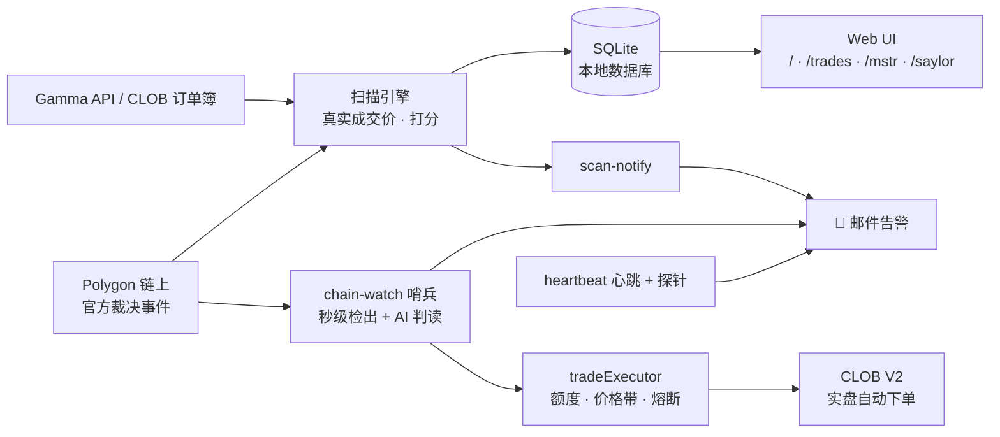
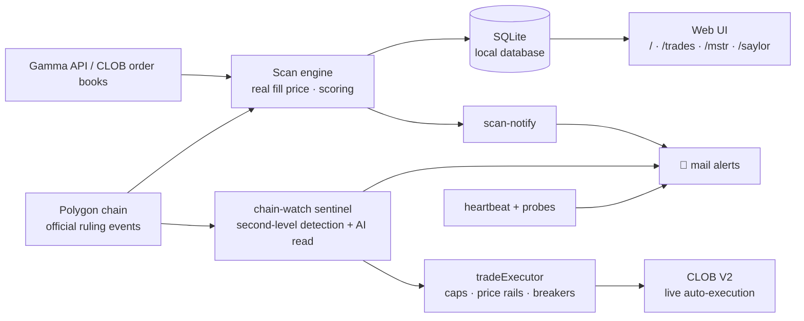

<div align="center">

# ⚡ PredEdge

**在市场读懂官方裁决之前,先一步下单。**

**Trade the ruling before the market reads it.**

一套围绕 Polymarket 打造的全自动交易系统:发现机会 → AI 判读 → 实盘下单 → 风控熔断,全程无人值守。

[简体中文](#-简体中文) · [English](#-english)

<br/>


</div>

---

## 🇨🇳 简体中文

### 💡 它靠什么赚钱?

先用一句话解释 Polymarket:它是全球最大的预测市场,人们在上面对"某件事会不会发生"下注。每份合约猜对了值 $1、猜错了归零,所以合约价格就是市场眼中的概率——0.95 的价格意味着市场认为有 95% 的把握。

**PredEdge 赚的是信息差的钱。核心逻辑:很多市场的最终答案,在正式结算之前就已经写在区块链上了——只是绝大多数人没看到,或者看不懂。**

Polymarket 的市场结果出现争议时,会走一套官方仲裁流程,而官方的澄清与裁决文本会直接发布到链上。这份文本基本等于提前剧透了最终答案,但它有三重"门槛"替我们挡住了竞争者:

- 它藏在链上合约事件里,普通交易者根本不会盯着看;
- 文本是一大段规则条文式的英文,人肉读懂方向要花时间;
- 从文本上链到市场价格反应过来,往往有几分钟到几小时的窗口。

PredEdge 的打法就是把这个窗口吃满,三步全自动:

1. **秒级发现** — 7×24 监听链上的每一次官方动作(争议、澄清、改判)。官方如果预告"将于某时刻发布澄清",系统还会提前蹲点、在承诺窗口内秒级检出;
2. **AI 判方向** — 正则规则先读一遍,Claude 再独立读一遍,两者结论一致且高置信才给 🟢 信号。AI 只做文本判读、从不预测事件本身,给出的方向必须能从官方原文里逐字引出来;
3. **自动下单** — 🟢 信号直接实盘买入,从链上检出到订单成交只要几秒,不需要人守在屏幕前。

这套分级不是拍脑袋:基于 15 个月、2,182 个历史信号、真实成交价的回测,🟢 双确认信号平均每笔 +21%,并且每年还有 2–4 次几倍到几十倍收益的"翻盘"肥尾机会。仓库里附有全套研究报告 PDF。

除此之外还有第二条腿:**尾价收割**。全网扫描定价在 0.93–0.995 之间、"九成九已成定局"的合约,逐档吃穿订单簿算出真实能成交的价格,风险打分后买入,稳稳吃掉最后几个点的收敛。

### 📈 经典战例:Saylor 买币市场(已退役)

Michael Saylor 的 Strategy(原 MicroStrategy)曾经连续多年几乎每周买入比特币,Polymarket 上也一直挂着对应的周度市场:**"MSTR 本周会买比特币吗?"**

他的节奏其实是可预测的:周末发"橙点"推特预告,周一提交 8-K 公告;财报静默期会停买,联邦假日会顺延,大型融资操作前后会打乱一两周。PredEdge 把推文线索、财报日历、假日和资本运作全部建模成信号,回测出的严格信号组合:**41 次交易、胜率 87.8%、平均每笔 +25.6%**。

如今 Strategy 已经开始出售比特币,持续多年的"每周买入"节奏被彻底打破,这个市场随之失去规律、宣告失效——策略光荣退役。但它恰恰是这套方法论的最佳注脚:**找到别人没发现的规律,在规律有效的窗口期里吃满利润,规律消失就干脆离场。** 完整的复盘与信号模型保留在 `/mstr` 和 `/saylor` 两个页面里。

### ✨ 功能一览

| 页面 | 说明 |
| --- | --- |
| 🔍 **扫描器** `/` | 全网扫出"九成九会发生"且仍有利可图的合约,按真实可成交价格与风险打分排序;可按标签筛选、按自己的仓位实时重算 |
| 📒 **纸面交易** `/trades` | 先用虚拟仓位验证策略,持续追踪每一笔选中标的的真实走势与盈亏 |
| 📊 **MSTR 复盘** `/mstr` | Saylor 买币策略的完整回测复盘与实盘验证记录 |
| 🐦 **Saylor 信号** `/saylor` | 推文线索 + 财报日历 + 假日建模出的周度买币概率预测(策略已退役,页面存档) |

### 🤖 全自动实盘执行

🟢 信号从检出到下单全自动完成,同时套着一整层"防呆"风控,每一道都是独立保险:

- **三档开关**:off / dry(全流程演练、不真下单)/ live
- **三层金额上限**:单笔、单日、未结算总敞口,层层封顶
- **价格防线**:入场价带约束、追高限制、暴跌守卫——市场已经反向定价时,拒绝去"捡便宜"
- **绝不重复下单**:下单前先落账(write-ahead 账本),哪怕进程在下单瞬间崩掉,重启后也不会对同一信号打第二枪
- **多重熔断**:kill-switch 文件一放即停、连续执行错误自动停、连续亏损自动停
- **自动对账**:结算后按官方结算价核算盈亏,直接发邮件汇报

上真金白银前有完整的体检流程:`exec-selftest` 逐项自检下单链路,支持全流程演练和 $1 实弹探针,验证通过再切 live。

### 🛰 无人值守运维

整套系统跑在一台小服务器上,自己照顾自己:

| 脚本 | 用途 |
| --- | --- |
| `npx tsx scripts/chain-watch.ts` | **主力哨兵**:监听链上官方动作 → AI 判读方向 → 分级邮件告警 → 🟢 信号自动下单;官方预告澄清时间时提前蹲点、秒级检出 |
| `npm run scan:notify` | 无头全网扫描,发现新机会就发一封排版好的 HTML 邮件,自动去重、绝不轰炸 |
| `npx tsx scripts/heartbeat.ts --watch` | 系统自检哨兵:通道断了、邮件发不出、登录态掉了,第一时间告警;恢复了也会告诉你 |
| `npx tsx scripts/heartbeat.ts --daily` | 每日运行日报,兼作"系统还活着"的心跳 |
| `npx tsx scripts/exec-selftest.ts` | 下单链路体检:钱包、凭证、余额、盘口逐项自检;`--dry-exec` 全流程演练,`--probe` $1 实弹探针 |
| `npm run mail:test` | 邮件配置自检 |

### 🚀 快速开始

```bash
npm install
npm run dev
```

打开 [http://localhost:3000](http://localhost:3000),在扫描器页点击 **Scan** 拉取最新市场(首次约 30–60 秒)。

> **本地运行,零云依赖。** 一次全量扫描要遍历数千个市场,本地跑没有 serverless 超时限制,数据也全部留在自己机器上。

所有数据(扫描批次、机会、赔率快照、纸面交易)都存在本地 SQLite,由 Node 内置的 `node:sqlite` 驱动,首次运行自动建库,无需任何外部数据库。要求 Node.js ≥ 24。

### 🏗 架构



<details>
<summary><b>⚙️ 环境变量(点击展开)</b></summary>

| 变量 | 说明 |
| --- | --- |
| `LOCAL_DB_PATH` | SQLite 数据库路径(默认 `data/prededge.sqlite`) |
| `SMTP_HOST` / `SMTP_PORT` / `SMTP_SECURE` | SMTP 服务器配置 |
| `MAIL_USER` / `MAIL_AUTH_CODE` | 发信账号与授权码 |
| `MAIL_FROM_NAME` / `MAIL_TO` | 发件人显示名 / 收件地址 |
| `POLYGON_RPC_URL` | 应用内链上读取所用的 Polygon RPC |
| `ONCHAIN_RPC_URLS` | chain-watch 的 RPC 列表(逗号分隔,多节点冗余) |
| `CHAIN_WATCH_STATE` | chain-watch 状态文件路径(默认 `data/chain-watch-state.json`) |
| `HC_PING_SCAN_NOTIFY` / `HC_PING_CHAIN_WATCH` / `HC_PING_HEARTBEAT` | healthchecks.io 外部保活 ping 地址 |
| `CLAUDE_CODE_OAUTH_TOKEN` | headless Claude 判读的认证(`claude setup-token` 生成);缺省时 LLM 二读关闭,回退纯正则分级 |
| `LLM_STANCE` / `LLM_STANCE_MODEL` | `off` 关闭 LLM 二读 / 判读模型(默认 `claude-opus-4-8`) |
| `LLM_BOUNDARY_GUARD` | `off` 关闭边界闸门标注(A/B 用) |
| `PAPER_TRADES_AUTO` | `off` 关闭 🟢 信号自动登记 paper_trades |
| `CHAIN_WATCH_PREARM` | `off` 关闭预告时点预埋与承诺窗口快轮询 |
| `EXEC_MODE` | 自动执行三态闸门:`off`(默认)/ `dry` / `live` |
| `EXEC_MAX_ORDER_USD` / `EXEC_DAILY_MAX_USD` / `EXEC_TOTAL_MAX_USD` | 单笔 / UTC 日 / 未结算总敞口上限(默认 50 / 150 / 400) |
| `EXEC_MIN_PRICE` / `EXEC_MAX_PRICE` | 入场价带(默认 0.15 / 0.97) |
| `EXEC_SLIPPAGE` / `EXEC_SLIPPAGE_EDGE_FRAC` / `EXEC_CRASH_DROP_FRAC` | 限价滑点帽 / 追高带边缩放系数 / 暴跌守卫系数 |
| `EXEC_LOSS_HALT_COUNT` | 连亏熔断阈值(默认 3 笔) |
| `EXEC_HALT_FILE` / `EXEC_LEDGER` | kill-switch 文件(默认 `data/trading-halt`)/ 交易账本(默认 `data/trade-ledger.jsonl`) |
| `EXEC_WALLET_JSON` / `EXEC_CREDS_JSON` / `EXEC_FUNDER` | EOA 钱包 JSON / CLOB L2 creds 缓存 / Polymarket proxy 钱包地址 |

</details>

---

## 🇬🇧 English

### 💡 How it makes money

One sentence on Polymarket first: it's the world's largest prediction market, where people bet on whether things will happen. Each contract pays $1 if you're right and $0 if you're wrong — so the price *is* the market's probability. A contract at 0.95 means the crowd is 95% sure.

**PredEdge earns an information edge. The core insight: for many markets, the final answer is written on the blockchain before settlement — most people just never see it, or can't parse it.**

When a Polymarket outcome is contested, it goes through an official arbitration process, and the official clarification and ruling text is published directly on-chain. That text is essentially a spoiler of the final answer — protected by three natural moats that keep competitors out:

- It's buried in on-chain contract events that ordinary traders never watch;
- It's a wall of legalistic English — reading out the direction by hand takes time;
- Between the text landing on-chain and the price catching up, there's typically a window of minutes to hours.

PredEdge is built to own that window, fully automated in three steps:

1. **Detect in seconds** — watch every official on-chain move (disputes, clarifications, resets) 24/7. When officials pre-announce "a clarification will be issued at …", the system stakes out the promised window and detects the text within seconds;
2. **AI reads the direction** — a rule-based pass first, then an independent Claude read; only when both agree at high confidence does a signal earn 🟢. The AI judges *text only* — it never predicts the event itself, and every directional verdict must be backed by a verbatim quote from the official text;
3. **Auto-execute** — 🟢 signals are bought live, seconds from on-chain detection to filled order. Nobody needs to be at a screen.

The tiers aren't vibes: a 15-month backtest over 2,182 historical signals, priced against real fills, shows 🟢 double-confirmed signals averaging **+21% per trade**, plus 2–4 fat-tail "reversal" opportunities a year that pay several-fold to tens-fold. The full research reports ship as PDFs in this repo.

There's a second leg too: **tail-price harvesting**. Sweep the entire market for contracts priced 0.93–0.995 — the "99% done deals" — walk the order book to compute the price you'd *actually* fill at, score the risk, and collect the last few cents of convergence.

### 📈 Case study: the Saylor bitcoin market (retired)

Michael Saylor's Strategy (formerly MicroStrategy) bought bitcoin almost every single week for years, and Polymarket ran a weekly market on it: **"Will MSTR buy bitcoin this week?"**

His rhythm was predictable: an "orange dot" tweet over the weekend, an 8-K filing on Monday; purchases paused during earnings quiet periods, slipped around federal holidays, and stuttered before big financing moves. PredEdge modeled all of it — tweet cues, the earnings calendar, holidays, capital actions — into signals. The strict-signal combo backtested at **41 trades, 87.8% win rate, +25.6% average per trade**.

Strategy has since started *selling* bitcoin. The years-long weekly cadence is broken, the pattern is gone, and the market is dead — the strategy retired with honors. Which is exactly the point of this whole methodology: **find a pattern others haven't noticed, harvest it while it lasts, and walk away the moment it stops working.** The full post-mortem and signal model live on at `/mstr` and `/saylor`.

### ✨ Features

| Page | Description |
| --- | --- |
| 🔍 **Scanner** `/` | Sweeps the whole market for "99% done" contracts that still pay, ranked by real fillable price and risk score; filter by tag, recompute live at your own trade size |
| 📒 **Paper Trading** `/trades` | Validate the strategy with virtual positions first — every pick is tracked against its real outcome |
| 📊 **MSTR Review** `/mstr` | Full backtest review and live verification record of the Saylor bitcoin strategy |
| 🐦 **Saylor Signal** `/saylor` | Weekly buy-probability model from tweet cues + earnings calendar + holidays (strategy retired, page archived) |

### 🤖 Live Auto-Execution

🟢 signals go from detection to filled order fully hands-free, wrapped in layered, independently-failing risk rails:

- **Three-position switch**: off / dry (full rehearsal incl. signing, nothing submitted) / live
- **Three spending caps**: per-order, per-day, and total open exposure
- **Price rails**: entry band, chase limit, and a crash guard — when the market is already pricing the other way, it refuses the "bargain"
- **Never double-fires**: a write-ahead ledger journals every order *before* it's posted — even a process dying mid-order can't make the same signal fire twice after restart
- **Multiple circuit breakers**: a kill-switch file halts everything instantly, consecutive errors auto-halt, consecutive losses auto-halt
- **Auto reconciliation**: realized PnL is booked against official settlement prices and reported by mail

Before real money moves, there's a full pre-flight: `exec-selftest` checks the entire order path item by item, with a full dry rehearsal and a $1 live probe — verify, then flip to live.

### 🛰 Headless Ops

The whole system runs on one small box and looks after itself:

| Script | Purpose |
| --- | --- |
| `npx tsx scripts/chain-watch.ts` | **The sentinel**: watches official on-chain moves → AI reads the direction → tiered mail alerts → 🟢 signals auto-execute; pre-arms on announced clarification times for second-level detection |
| `npm run scan:notify` | Headless full-market scan; mails a formatted HTML alert only for genuinely new opportunities — deduped, never spammy |
| `npx tsx scripts/heartbeat.ts --watch` | Self-monitoring sentinel: a dead channel, failing mailer, or dropped login gets flagged immediately — and you're told when it heals |
| `npx tsx scripts/heartbeat.ts --daily` | Daily ops report, doubling as the "system alive" heartbeat |
| `npx tsx scripts/exec-selftest.ts` | Order-path physical: wallet, creds, balance, order book checked item by item; `--dry-exec` full rehearsal, `--probe` $1 live probe |
| `npm run mail:test` | SMTP self-test |

### 🚀 Getting Started

```bash
npm install
npm run dev
```

Open [http://localhost:3000](http://localhost:3000) and click **Scan** on the Scanner page to fetch the latest markets (the first run takes 30–60s).

> **Local-first, zero cloud dependencies.** A full scan walks thousands of markets — running locally means no serverless timeouts, and all data stays on your own machine.

Everything (scan runs, opportunities, odds snapshots, paper trades) lives in a local SQLite database powered by Node's built-in `node:sqlite`, created automatically on first run — no external database. Requires Node.js ≥ 24.

### 🏗 Architecture



<details>
<summary><b>⚙️ Environment Variables (click to expand)</b></summary>

| Variable | Description |
| --- | --- |
| `LOCAL_DB_PATH` | SQLite database path (default `data/prededge.sqlite`) |
| `SMTP_HOST` / `SMTP_PORT` / `SMTP_SECURE` | SMTP server configuration |
| `MAIL_USER` / `MAIL_AUTH_CODE` | Sender account and auth code |
| `MAIL_FROM_NAME` / `MAIL_TO` | Sender display name / recipient address |
| `POLYGON_RPC_URL` | Polygon RPC used for on-chain reads inside the app |
| `ONCHAIN_RPC_URLS` | RPC list for chain-watch (comma-separated, multi-node redundancy) |
| `CHAIN_WATCH_STATE` | chain-watch state file path (default `data/chain-watch-state.json`) |
| `HC_PING_SCAN_NOTIFY` / `HC_PING_CHAIN_WATCH` / `HC_PING_HEARTBEAT` | healthchecks.io external liveness ping URLs |
| `CLAUDE_CODE_OAUTH_TOKEN` | Auth for headless Claude second reads (from `claude setup-token`); when absent, tiering falls back to regex only |
| `LLM_STANCE` / `LLM_STANCE_MODEL` | `off` disables the LLM second read / judgment model (default `claude-opus-4-8`) |
| `LLM_BOUNDARY_GUARD` | `off` disables the boundary-clarification tag (for A/B) |
| `PAPER_TRADES_AUTO` | `off` disables automatic paper-trade registration of 🟢 signals |
| `CHAIN_WATCH_PREARM` | `off` disables scheduled-clarification pre-arm and the promised-window fast poll |
| `EXEC_MODE` | Auto-execution gate: `off` (default) / `dry` / `live` |
| `EXEC_MAX_ORDER_USD` / `EXEC_DAILY_MAX_USD` / `EXEC_TOTAL_MAX_USD` | Per-order / UTC-daily / open-exposure caps (defaults 50 / 150 / 400) |
| `EXEC_MIN_PRICE` / `EXEC_MAX_PRICE` | Entry price band (defaults 0.15 / 0.97) |
| `EXEC_SLIPPAGE` / `EXEC_SLIPPAGE_EDGE_FRAC` / `EXEC_CRASH_DROP_FRAC` | Limit-price slippage cap / chase-band edge scaling / crash-guard fraction |
| `EXEC_LOSS_HALT_COUNT` | Consecutive settled-loss circuit-breaker threshold (default 3) |
| `EXEC_HALT_FILE` / `EXEC_LEDGER` | Kill-switch file (default `data/trading-halt`) / trade ledger (default `data/trade-ledger.jsonl`) |
| `EXEC_WALLET_JSON` / `EXEC_CREDS_JSON` / `EXEC_FUNDER` | EOA wallet JSON / CLOB L2 creds cache / Polymarket proxy wallet address |

</details>

---

<div align="center">
<sub>Built with Next.js · Local-first · No external database · Research reports included as PDFs</sub>
</div>
